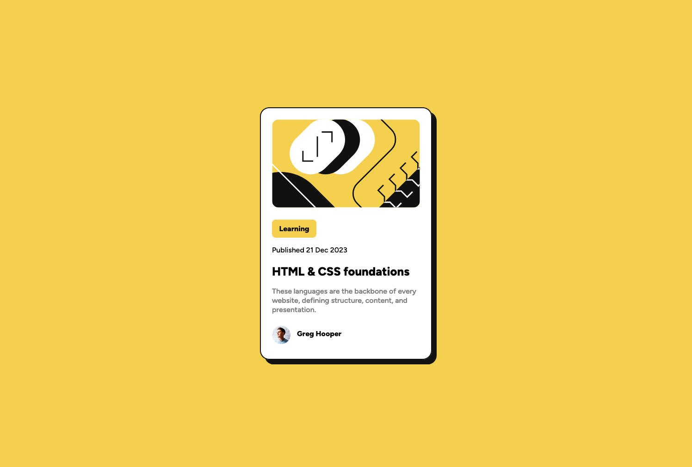
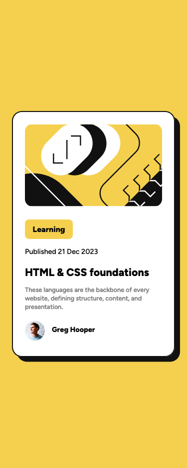

# Frontend Mentor - Blog preview card solution

This is a solution to the [Blog preview card challenge on Frontend Mentor](https://www.frontendmentor.io/challenges/blog-preview-card-ckPaj01IcS). Frontend Mentor challenges help you improve your coding skills by building realistic projects.

## Table of contents

- [Overview](#overview)
  - [The challenge](#the-challenge)
  - [Screenshot](#screenshot)
  - [Links](#links)
- [My process](#my-process)
  - [Built with](#built-with)
  - [Useful resources](#useful-resources)

## Overview

### The challenge

Users should be able to:

- See hover and focus states for all interactive elements on the page

### Screenshot

### Links

- Solution URL: [Link](https://www.frontendmentor.io/solutions/blog-preview-card-cnhlg11RYZ)
- Live Site URL: [Link](https://blog-preview-card-indol-theta.vercel.app/)

## My process

### Built with

- Semantic HTML5 markup
- CSS custom properties
- Flexbox
- Mobile-first workflow

### Useful resources

- [Breaking down CSS Box Shadow vs. Drop Shadow on CSS-Tricks](https://css-tricks.com/breaking-css-box-shadow-vs-drop-shadow/) - This is an amazing article which helped me understand the difference between `box-shadow` and `filter: dropshadow()`. I'd recommend it to anyone still learning this concept.
- [Button Hover Effect Using HTML And CSS | Hover Effect CSS by GreatStack](https://www.youtube.com/watch?v=Pmo6y5b2Uec) - This video helped me understand how to do the hover effect where the shadow grows bigger.
